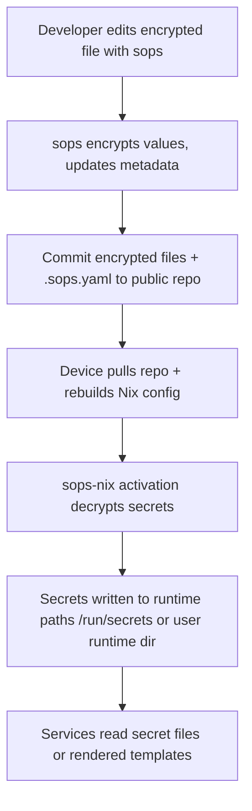
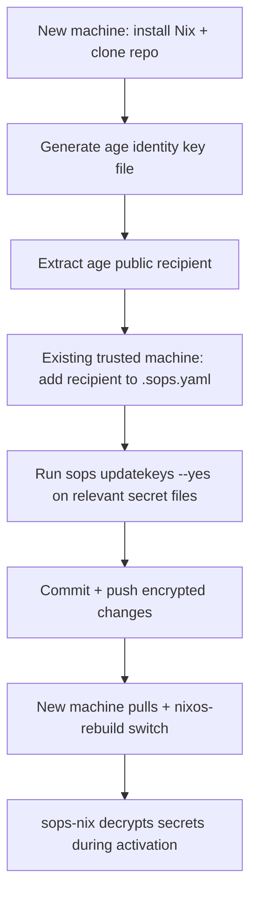
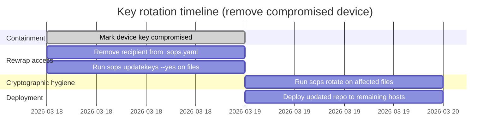

# sops-nix for Public Dotfiles Across Three Devices

## Executive summary

A robust, reproducible setup for storing service secrets *alongside dotfiles in a public repo* is to encrypt all secret material with **SOPS** and provision it at runtime with **sops-nix**, using **age** recipients per device plus an optional offline recovery key. In this model, only encrypted files and a public `.sops.yaml` live in the repo; secrets are decrypted on the target machine during activation, written to ephemeral runtime paths (e.g. `/run/secrets`), and upgraded atomically (supporting safe rollbacks if you keep generations). citeturn3view0turn3view4

The most practical structure for “three devices, same repo” is to maintain:
- **Per-device secrets**: encrypted to *only that device’s* key (and optionally a recovery key).
- **Shared secrets**: encrypted to *all three devices’* keys (and optionally a recovery key).  
This is implemented using `.sops.yaml` `creation_rules` keyed by `path_regex` patterns, then propagated into existing encrypted files using `sops updatekeys` (recommended by the SOPS maintainers). citeturn3view1turn5view0turn5view3

For key syncing: the safest default is **not** to sync long-lived private keys between devices. Instead, use **per-device keys** and grant access by adding/removing recipients (for SOPS/age) or by using **GPG subkeys** and **SSH certificates** for authentication workflows. If you must sync keys, do it with explicit backup/transfer procedures and accept the threat-model implications (detailed below). citeturn12search4turn11search10turn2search6turn5view0

For “master key derived from a passphrase hashed with Argon2”: neither SOPS nor sops-nix natively operates with an Argon2-derived “master key” in the way password managers do; SOPS uses *master keys* such as age recipients, PGP keys, or cloud KMS keys. If you want passphrase gating, the closest standardized option in the ecosystem is **age passphrase encryption**, which uses **scrypt** (per the age v1 spec), *not* Argon2; Argon2id remains the modern recommendation for password hashing/KDF in general, but integrating it into SOPS keying is not a standard, documented pattern. citeturn9view0turn1search6turn3view1

## Assumptions and scope

This report assumes:
- You want a **single Git repo** (public) containing dotfiles and **only encrypted secret files** plus a `.sops.yaml`. SOPS is designed for version-control-friendly encrypted files and supports multiple storage formats; sops-nix is explicitly designed for secrets decrypted during activation and stored as files with declarative permissions. citeturn3view0turn3view1turn3view4
- Your “three devices” are **at least partially Nix-managed** (e.g., NixOS and/or nix-darwin and/or Home Manager). sops-nix provides modules for NixOS, nix-darwin, and Home Manager; the Home Manager module decrypts into `$XDG_RUNTIME_DIR` and symlinks into `$HOME/.config/sops-nix/secrets`. citeturn10view2turn10view3turn10view4
- “Reproducible onboarding” means: after minimal bootstrapping (install Nix + clone repo + generate/import keys), a machine can fully converge via a standard rebuild/switch path while secrets are provisioned at runtime—consistent with sops-nix’s activation-time design. citeturn6view1turn3view0
- You want guidance that applies even if the OS mix is unknown; therefore the examples emphasize NixOS + flakes, with notes for nix-darwin and Home Manager where sops-nix explicitly differs. citeturn10view2turn10view4turn10view3

Threat model phrases used below:
- “Repo compromise”: attacker can read your public repo (baseline).
- “Device compromise”: attacker gets root or can exfiltrate local files on one device.
- “Key compromise”: attacker obtains a private key used as a SOPS master key.
These map onto SOPS’s principle that encrypted-data security is “as strong as the weakest cryptographic mechanism,” and that multiple master keys allow sharing and disaster recovery without sharing master keys. citeturn3view3turn5view2

## Architecture and repository layout

A solid repo layout separates **host configs**, **user configs**, and **secret material** while keeping `.sops.yaml` at the repo root (so SOPS finds it when editing from subdirectories). SOPS searches for the first `.sops.yaml` in the current directory and its parents, and it must be named `.sops.yaml` (not `.sops.yml`) to be auto-discovered. citeturn3view1turn3view2

Recommended layout:

```text
repo/
  flake.nix
  flake.lock
  .sops.yaml

  hosts/
    laptop/
      configuration.nix
      hardware-configuration.nix
    desktop/
      configuration.nix
      hardware-configuration.nix
    server/
      configuration.nix
      hardware-configuration.nix

  home/
    common.nix
    laptop.nix
    desktop.nix
    server.nix

  secrets/
    shared/
      services.yaml              # shared secrets (SOPS-encrypted)
      shared.env                 # shared dotenv secrets (SOPS-encrypted)
      tls/
        wildcard.key             # binary secret example (SOPS-encrypted)
    hosts/
      laptop/
        wifi.yaml
        backups.env
      desktop/
        backups.env
      server/
        db.env

  scripts/
    bootstrap-new-host.sh
    enroll-host-recipient.sh
    rotate-keys.sh
    rotate-secrets.sh

  docs/
    onboarding.md
    recovery.md
    rotation.md
```

Key design decision: **one secret file per “blast radius”** (shared vs device) instead of one global monolith. sops-nix supports per-secret `sopsFile` overrides, and it also supports multiple formats (yaml/json/dotenv/ini/binary), which makes it clean to keep service-specific secrets near the services they configure. citeturn7view1turn3view4turn3view0

SOPS *keeps key names in cleartext* for diff/readability; it “expects that keys do not carry sensitive information.” In a public repo, this means your YAML/JSON *structure itself* can leak service names, environments, or topology—even if values are encrypted—so design keys accordingly (e.g., avoid embedding customer names or incident identifiers in key names). citeturn5view2

Mermaid workflow of the intended lifecycle (editor → Git → deploy → runtime provisioning):



This matches sops-nix’s model: secrets are decrypted at **activation time**, written as one secret per file (with declarative permissions), and updated atomically. citeturn3view0turn6view1

## `.sops.yaml` and sops-nix configuration patterns

### `.sops.yaml` for per-device and shared secrets

SOPS `creation_rules` let you select master keys (age recipients, PGP fingerprints, KMS keys, etc.) based on filename patterns; `path_regex` controls which rule matches, and `age`/`pgp` can be specified as lists. citeturn3view1turn3view2

A practical `.sops.yaml` for three devices + optional offline recovery recipient:

```yaml
# .sops.yaml (repo root)
# Public file: contains only public recipients / fingerprints and matching rules.

keys:
  # Per-device age recipients (public)
  - &laptop   age1xxxxxxxxxxxxxxxxxxxxxxxxxxxxxxxxxxxxxxxxxxxxxxxxxxxx
  - &desktop  age1yyyyyyyyyyyyyyyyyyyyyyyyyyyyyyyyyyyyyyyyyyyyyyyyyyyy
  - &server   age1zzzzzzzzzzzzzzzzzzzzzzzzzzzzzzzzzzzzzzzzzzzzzzzzzz
  # Optional recovery recipient (public)
  - &recovery age1rrrrrrrrrrrrrrrrrrrrrrrrrrrrrrrrrrrrrrrrrrrrrrrrrrrr

creation_rules:
  # Shared secrets: decryptable on all three devices (+ recovery)
  - path_regex: ^secrets/shared/.*\.(yaml|yml|json|env|ini|key)$
    age:
      - *laptop
      - *desktop
      - *server
      - *recovery

  # Per-device secrets: only the device (+ recovery)
  - path_regex: ^secrets/hosts/laptop/.*\.(yaml|yml|json|env|ini|key)$
    age: [*laptop, *recovery]

  - path_regex: ^secrets/hosts/desktop/.*\.(yaml|yml|json|env|ini|key)$
    age: [*desktop, *recovery]

  - path_regex: ^secrets/hosts/server/.*\.(yaml|yml|json|env|ini|key)$
    age: [*server, *recovery]
```

Why this works well:
- It is aligned with SOPS’s documented config structure (`creation_rules`, `path_regex`, and `age` recipient lists). citeturn3view1
- It supports easy access changes by editing `.sops.yaml` then running `sops updatekeys` (recommended approach). citeturn5view0turn5view3
- It gives you a simple mental model of blast radius: *host directory = host-only decryption*, *shared directory = all-devices decryption*. citeturn3view1turn5view0

### sops-nix: core system module wiring

sops-nix decrypts secrets only during activation; it is not possible to safely consume secrets during Nix evaluation, and sops-nix explicitly notes this limitation (and points to “evaluate-time” alternatives for exceptional cases). citeturn6view1

A canonical flake wiring for NixOS imports `sops-nix.nixosModules.sops`: citeturn10view0turn10view2

```nix
# flake.nix (snippet)
{
  inputs = {
    nixpkgs.url = "github:NixOS/nixpkgs/nixos-unstable";
    sops-nix.url = "github:Mic92/sops-nix";
    sops-nix.inputs.nixpkgs.follows = "nixpkgs";
  };

  outputs = { self, nixpkgs, sops-nix, ... }: {
    nixosConfigurations.laptop = nixpkgs.lib.nixosSystem {
      system = "x86_64-linux";
      modules = [
        ./hosts/laptop/configuration.nix
        sops-nix.nixosModules.sops
      ];
    };
  };
}
```

Then, in a host config, you set where secrets come from and how decryption keys are provided. sops-nix supports age or GPG, and it can also derive identities from SSH host keys (compatibility shims) for some workflows. citeturn3view0turn3view4turn7view2

```nix
# hosts/server/configuration.nix (snippet)
{ config, pkgs, ... }:
let
  host = config.networking.hostName;
in
{
  sops = {
    defaultSopsFormat = "yaml";

    # Option A: dedicated age key file (recommended for clarity)
    age.keyFile = "/var/lib/sops-nix/key.txt";
    age.generateKey = false;

    # Option B: decrypt using SSH host keys as age identities (auto-import)
    # age.sshKeyPaths = [ "/etc/ssh/ssh_host_ed25519_key" ];

    # You can still keep a shared default for convenience:
    defaultSopsFile = ../../secrets/shared/services.yaml;
  };

  sops.secrets."myservice.env" = {
    sopsFile = ../../secrets/hosts/${host}/myservice.env;
    format = "dotenv";
    owner = "myservice";
    group = "myservice";
    mode = "0400";
    restartUnits = [ "myservice.service" ];
  };

  systemd.services.myservice = {
    wantedBy = [ "multi-user.target" ];
    serviceConfig = {
      EnvironmentFile = config.sops.secrets."myservice.env".path;
      ExecStart = "${pkgs.myservice}/bin/myservice";
      User = "myservice";
      Group = "myservice";
    };
  };
}
```

Why these options matter:
- `sops.age.keyFile` and `sops.age.generateKey` are first-class options: if `generateKey` is false, the key must exist; if true, sops-nix generates it. citeturn3view4turn7view0
- Secrets default to `/run/secrets/<name>` (or `/run/secrets-for-users/<name>` when `neededForUsers` is set), matching sops-nix’s ephemeral runtime approach. citeturn3view4
- `restartUnits` exists specifically to restart dependent units when a secret changes—useful for safe rotation. citeturn6view0turn3view4

### Templates for “secrets embedded in config files”

If a service requires a config file containing secrets inline, use sops-nix templates: placeholders are substituted during activation and the rendered file lives under `/run/secrets-rendered` by default. citeturn6view1turn6view0

```nix
# Example: render a TOML config file with a secret
{
  sops.secrets.db_password = {
    sopsFile = ../../secrets/hosts/${config.networking.hostName}/db.yaml;
    key = "password";
  };

  sops.templates."app.toml".content = ''
    [database]
    password = "${config.sops.placeholder.db_password}"
  '';

  systemd.services.app.serviceConfig.ExecStart =
    "${pkgs.app}/bin/app --config ${config.sops.templates."app.toml".path}";
}
```

This pattern is explicitly supported and documented by sops-nix, and it avoids the common anti-pattern of trying to pull secrets into the Nix store at evaluation time. citeturn6view1turn6view0

## Key management and sync strategies

### Age, SSH, and GPG as SOPS master keys

SOPS supports age recipients and can source age identities in several ways (key file, env var, or command). It can also encrypt to SSH public keys via age, and when decrypting it can attempt to find the SSH private key via environment variables or default key paths—though only specific SSH key types are supported. citeturn3view1turn7view2

sops-nix supports both GPG and age, and explicitly notes compatibility shims using SSH keys: at a high level it can use GPG keys or age keys; it can convert SSH Ed25519 keys to age (`ssh-to-age`) and SSH RSA keys to PGP (`ssh-to-pgp`). citeturn3view0turn7view4turn7view5

### Recommended default: per-device age keys + optional recovery key

For your stated goal (three devices, per-device + shared secrets, public repo, reproducible onboarding), the most straightforward—and easiest to reason about under compromise—is:

- Each device has its **own age identity** stored locally (e.g., `/var/lib/sops-nix/key.txt`).
- `.sops.yaml` contains the **three public recipients** and encrypts shared vs host secrets accordingly.
- Optionally: add an **offline recovery age recipient** to every rule, analogous to SOPS’s own “disaster recovery” idea of having an offline master key in addition to primary keys. citeturn5view2turn7view0

This setup makes “device compromise” impact bounded for per-device secrets, while still supporting shared secrets by encrypting to multiple recipients (age supports multiple recipients; SOPS also supports multiple master keys, and SOPS key groups exist when you specifically want multiple keys required). citeturn4view0turn5view2turn3view3

### Table: key sync and access options for three devices

| Approach | What you sync | Unattended boot decryption | Blast radius if one device is compromised | Operational complexity | Notes / security tradeoffs |
|---|---|---:|---|---|---|
| Per-device age keys (recommended) | Nothing (unique private key per device) | Yes (key file on disk) | Per-device secrets stay isolated; shared secrets exposed if encrypted to that device | Medium | Matches `.sops.yaml` `creation_rules` and `sops updatekeys` workflows. citeturn3view1turn5view0turn7view0 |
| Single shared age key on all devices | Same private key on all devices | Yes | Full compromise of all secrets encrypted to that key | Low | Simplest, but defeats per-device isolation; essentially “one key to rule them all.” (Inference built on SOPS’s multi-master-key model.) citeturn5view2turn3view3 |
| Use SSH host keys as age identities | Nothing between devices; relies on host key | Yes, if host key exists early | Compromise of host key = compromise of all secrets encrypted to its recipient | Medium | sops-nix can auto-import SSH host keys as age identities; needs host keys persisted early for ephemeral-root setups. citeturn3view4turn7view2turn7view0 |
| Use SSH user keys as age recipients | Potentially sync SSH keys | Sometimes (but SOPS expects usable private key file) | Depends on whether SSH key is shared | Medium | age supports SSH recipients, but `ssh-agent` is not supported for decryption and SSH key support can embed identifying tags in ciphertext. citeturn4view0turn9view0turn3view1 |
| GPG as SOPS master key | Potentially sync GPG secret keys/subkeys | Sometimes (depends on passphrase/agent) | Depends on which keys are present on a device | Medium–High | GPG works, but operationally heavier; exporting secret keys is explicitly warned as a security risk if done over insecure channels. citeturn3view0turn2view3turn11search10turn2search39 |
| Cloud KMS / Vault master keys | Nothing local (depends on cloud identity) | Yes *if* cloud credentials available | Compromise of cloud credentials can grant decrypt access; mitigations are out-of-band | High | SOPS supports KMS/Vault; sops-nix notes “not officially supported yet” but can be controlled via environment variables. citeturn3view0turn3view1turn3view2 |

### Syncing GPG keys across devices safely

If you want a single identity across machines (e.g., for signing and decrypting), do **not** treat the private key as a casual sync artifact. Official GnuPG docs emphasize:
- Generate a revocation certificate early (`--gen-revoke` / `--generate-revocation`) and keep it safe, so you can revoke the public key if the private key is compromised or lost. citeturn2search27turn2search3
- Exporting secret keys (`--export-secret-keys` / `--export-secret-subkeys`) is useful for moving keys or backup, but it can be a **security risk** if transferred insecurely. citeturn11search10turn2search39
- Subkeys can be added with `addkey`, and subkeys can be revoked (`revkey`)—making it possible to use device-specific subkeys without keeping a master-capable key online full-time. citeturn12search4turn12search0

**Best-practice pattern (high-level):** keep a high-value “master” key offline, use subkeys day-to-day, and rotate/revoke subkeys when a device is lost. This is an operational recommendation grounded in GnuPG’s built-in support for subkeys and revocation flows. citeturn12search4turn2search27turn11search10turn12search0

### Syncing SSH keys across devices vs alternatives

For SSH authentication, “sync the same private key everywhere” is convenient but expands compromise impact. Alternatives:

- **Per-device SSH keys** with multiple authorized keys on servers (manual but straightforward).
- **SSH certificates**: OpenSSH certificates are signed by a CA key using `ssh-keygen`, and encode identity + constraints; this is operationally compelling when you have multiple devices because you don’t need to distribute every device’s public key to every server—just distribute the CA’s public key to servers and issue short-lived certs to devices. citeturn2search6turn1search21
- **Agent forwarding** (avoid copying keys onto intermediate hosts): GitHub’s documentation frames agent forwarding as a way to use local keys without leaving keys (especially unprotected ones) on servers. However, you must treat agent forwarding as sensitive, and OpenSSH has added features and mitigations (agent restrictions, PKCS#11 loading controls) specifically because forwarded agents can be abused under some conditions. citeturn2search33turn8search2turn8search9turn2search1

In practice, SSH certificates are the cleanest “don’t sync private keys” solution when your goal is consistent identity across devices. citeturn2search6turn1search21

## KDF and “passphrase-derived master key” feasibility

### What SOPS and sops-nix actually key on

SOPS encrypts values with a per-file data key (and maintains metadata containing encrypted copies of that data key for each master key), and it supports master keys such as age recipients, PGP keys, and various KMS backends. citeturn5view2turn3view1turn3view2

sops-nix then decrypts SOPS files at activation time (system module) or via a user systemd service (Home Manager module) and places results in ephemeral runtime locations. This design is why secrets are not available at evaluation time in “pure Nix” terms. citeturn6view1turn10view3

### What “passphrase-derived” means in this ecosystem

In the age ecosystem, passphrase encryption exists as a standardized recipient type based on **scrypt**: the age v1 spec defines the `scrypt` stanza, including `N` (as base-2 log work factor), `r=8`, `p=1`, and references RFC 7914 for scrypt. citeturn9view0

However:
- age passphrase mode is *interactive* and designed for user-in-the-loop usage, and the spec explicitly discusses work-factor constraints (implementations should cap work). citeturn9view0turn4view0
- sops-nix “just decrypt at activation” typically implies **non-interactive decryption**, which is consistent with the sops-nix docs’ warnings that decryption key files (for user module examples) “must have no password,” and that using SSH keys for age decryption only works when the key has no password. citeturn7view0turn10view3turn3view1

So the standard options are:
- Use unencrypted local key files + rely on device security (disk encryption, file permissions, physical security).
- Use hardware-backed or remote master keys (increases complexity).
- Use age passphrase encryption for *backup artifacts*, not for unattended boot decryption.

### Table: KDF approaches and how they map to SOPS/sops-nix

| Approach | Standard reference | Where it fits well | Fit for unattended sops-nix boot | Key risk considerations |
|---|---|---|---:|---|
| Argon2id KDF | **RFC 9106** (Argon2 memory-hard function) | Great for password hashing / passphrase-derived secrets in general systems | Not a direct SOPS master-key mode | Strong modern choice for passphrase hashing; integrating it into SOPS keying is not a documented SOPS pattern. citeturn1search6turn1search23turn3view1 |
| scrypt KDF (age passphrase recipient) | age v1 spec defines `scrypt` stanza and parameters (RFC 7914 referenced) | Encrypting files with a passphrase using age tooling | Usually **no** (needs interactive passphrase unless you automate unsafely) | Work factor is in the file header; implementations should cap it; interactive usage is emphasized. citeturn9view0turn4view0turn4view2 |
| No KDF: unencrypted age identity file on disk | sops-nix expects local key file; can auto-generate and use it | Best for reproducible, unattended provisioning | **Yes** | Security depends on host protections; simplest operational model for sops-nix. citeturn7view0turn3view4turn6view1 |

**Practical recommendation:** if “Argon2 from a passphrase” is a hard requirement, treat it as a *device unlock / disk encryption / password-manager* layer rather than trying to retrofit it into SOPS master-keying. The normative references support Argon2’s suitability as a password hash/KDF, but SOPS’s documented configuration model centers on master keys like age/PGP/KMS. citeturn1search6turn3view1turn3view2

## Reproducible onboarding and automation

### Constraints to design around

Onboarding a brand-new machine into a “SOPS in public Git repo” model has a bootstrapping loop:

1. The machine needs a private key to decrypt secrets at activation.
2. Secret files must already be encrypted to the corresponding public recipient.
3. Therefore you must enroll the new recipient into `.sops.yaml` and run `sops updatekeys` *before* expecting the machine to decrypt shared/per-device secrets.

This is the same fundamental flow SOPS documents for adding/removing recipients: edit `.sops.yaml`, then apply it to files via `updatekeys` (recommended), and rotate data keys when removing access. citeturn5view0turn5view3turn5view0

### Practical onboarding workflow (two-phase)

Mermaid flowchart focusing on actions and artifacts:



This aligns with:
- `.sops.yaml` use for recipient selection and `updatekeys` for propagation. citeturn3view1turn5view3turn21view0
- sops-nix’s activation-time decryption model. citeturn6view1turn3view0

### Automation building blocks

**Key generation and recipient extraction (age):** sops-nix documents generating an age key with `age-keygen`, and extracting the public recipient with `age-keygen -y`. citeturn7view2turn10view4

**Non-interactive updatekeys:** SOPS’s CLI code shows `updatekeys` supports `--yes, -y` (“pre-approve all changes and run non-interactively”) and that interactivity is disabled when `--yes` is set. citeturn21view0turn21view2

A repo-side script pattern (illustrative; adjust paths):

```bash
#!/usr/bin/env bash
set -euo pipefail

HOST="$1"            # laptop|desktop|server
RECIPIENT="$2"       # age1...

# 1) Update .sops.yaml (you can do this with yq or manual edit)
# 2) Apply new recipients to the encrypted files for this host + shared
find "secrets/shared" "secrets/hosts/$HOST" -type f \
  \( -name '*.yaml' -o -name '*.yml' -o -name '*.json' -o -name '*.env' -o -name '*.ini' -o -name '*.key' \) \
  -print0 \
| xargs -0 -n1 sops updatekeys --yes

git add .sops.yaml secrets/
git commit -m "Enroll $HOST recipient and rewrap secrets"
```

The correctness here depends on the documented semantics:
- `updatekeys` applies `.sops.yaml` creation rules to update/add/remove master keys. citeturn5view3turn21view0
- The file matching rules (`path_regex`) and key selection are defined in `.sops.yaml`. citeturn3view1turn3view2

### Notes for nix-darwin and Home Manager onboarding

- sops-nix provides a nix-darwin module, and it documents that age keys should be stored under `~/Library/Application Support/sops/age/keys.txt` (or you set a custom config dir). citeturn10view4turn7view2
- The Home Manager module decrypts secrets via a user systemd service (`sops-nix.service`) into `$XDG_RUNTIME_DIR/secrets.d` and symlinks them into the user home; other user services should order after `sops-nix.service`. citeturn10view3

## Backup, recovery, and rotation procedures

### Backup and recovery

**Age identity backups (for machines):**
- SOPS documents that an age key file can be provided via `SOPS_AGE_KEY_FILE` or other mechanisms and that the key file contains a list of age identities (one per line). This is the canonical artifact to back up securely if you want disaster recovery for a machine key. citeturn3view1turn7view2
- If you use sops-nix with impermanent roots, sops-nix explicitly warns that your decryption key file (or host SSH keys) must be persisted and available early in boot. citeturn7view0

**GPG backups and recovery planning:**
- The GNU Privacy Handbook recommends generating a revocation certificate immediately after key creation (`--gen-revoke`) and explains why this matters if you lose a key or passphrase. citeturn2search27turn2search3
- GnuPG FAQ confirms you can export/import secret keys to move them between machines, while also implying that exporting secret keys is a meaningful action and should be done carefully. citeturn2search39turn11search10

A pragmatic recovery runbook (conceptual, not OS-specific):
1. Maintain an **offline recovery recipient** in `.sops.yaml` (public key only in repo).
2. Store the corresponding private key offline (encrypted removable media + physical backup), and test decryption periodically on an isolated environment.
3. If a primary device key is lost, re-enroll a new recipient and remove the old key via `.sops.yaml` + `updatekeys` and rotate data keys (see below). citeturn5view0turn5view3turn2search27

### Encryption key rotation vs secret value rotation

SOPS distinguishes:
- **Re-wrapping master keys / recipients** (who can decrypt): done via `.sops.yaml` + `updatekeys`, or by direct edits/flags; the maintainers recommend `updatekeys`. citeturn5view0turn5view3
- **Rotating the data encryption key** (fresh data key for same plaintext): done via `sops rotate`; docs recommend renewing the data key regularly. citeturn3view2turn5view5

When removing keys, SOPS explicitly recommends rotating the data key; otherwise, removed key owners may have had access to the data key in the past. citeturn5view0

### Key rotation procedure (three-device repo)

A common “remove compromised device key” timeline:



The steps are grounded in SOPS’s documented removal/rotation guidance and in the existence of non-interactive `updatekeys --yes`. citeturn5view0turn3view2turn21view0

### Secret value rotation procedure (service credentials)

When you rotate a secret value (e.g., database password):
1. Update the secret in place using `sops edit` (or other SOPS-supported operations).
2. Commit the encrypted diff.
3. Deploy; sops-nix will detect a changed secret and can restart units if you configured `restartUnits`. citeturn3view0turn6view0turn5view2

This aligns with sops-nix’s design of access-controlled files per secret and its restart hooks, and with SOPS’s encryption model where values are encrypted with AEAD (AES-GCM in SOPS) using a per-file data key. citeturn3view0turn6view0turn5view2

### Table: threat model implications of major design choices

| Threat scenario | Per-device age keys + shared secrets | Single shared key on all devices | SSH host-key-based decryption | GPG-based decryption | Notes |
|---|---|---|---|---|
| Public repo readable by everyone | Safe if only encrypted files + `.sops.yaml` with public recipients | Same | Same | Same | Baseline: SOPS files are designed to be committed encrypted; `.sops.yaml` is just config + public identifiers. citeturn3view0turn3view1turn3view2 |
| One device compromised | Attacker decrypts secrets encrypted to that device (host secrets + shared) | Attacker decrypts *everything* | Attacker decrypts secrets for that host if host key exfiltrated | Attacker decrypts anything that device’s secret key can decrypt | Multi-recipient encryption implies shared secrets are vulnerable to compromise of any recipient key. citeturn5view2turn3view3 |
| Remove a key from access control | Use `.sops.yaml` + `updatekeys`, then rotate data key | Same | Same | Same | SOPS recommends rotating the data key when removing master keys to reduce risk of past access. citeturn5view0turn5view3 |
| Need unattended provisioning | Works well (local key file) | Works well | Works well if host keys present early | Often harder if passphrases/agents involved | sops-nix runs during activation; examples emphasize decryption keys without passwords for automation. citeturn6view1turn7view0turn10view3 |
| Use agent forwarding to avoid key copies | Orthogonal (not for SOPS decryption) | Orthogonal | Orthogonal | Helpful for SSH auth use-cases | Agent forwarding reduces need to copy SSH keys to remote machines, but has security caveats and OpenSSH has added agent restrictions and PKCS#11 protections. citeturn2search33turn8search2turn8search9turn2search1 |

### Handling advanced setups: key groups and key services

If you want “two-person rule” or “require multiple master keys,” SOPS key groups can enforce thresholds using Shamir secret sharing; this is a real feature, but it typically conflicts with unattended single-machine decryption unless you introduce a remote key service or hardware interaction. citeturn5view2turn3view3

SOPS also supports a key service client-server model, but warns the key service connection currently lacks authentication/encryption; it recommends securing it via other means (e.g., SSH tunnel). citeturn5view2
